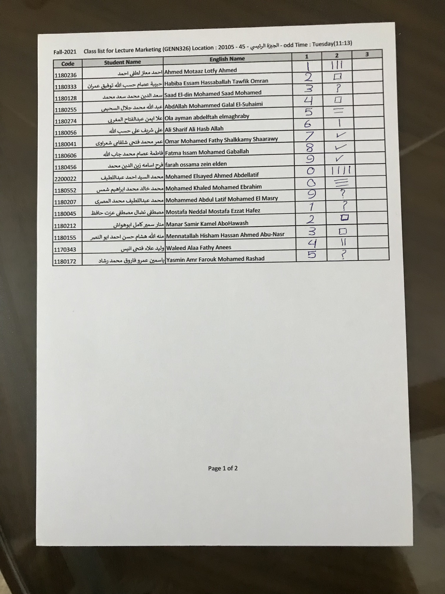
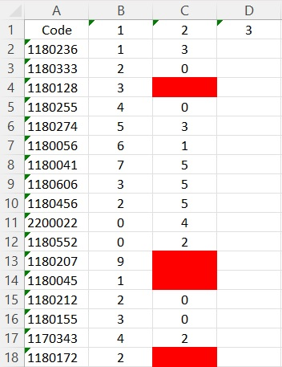
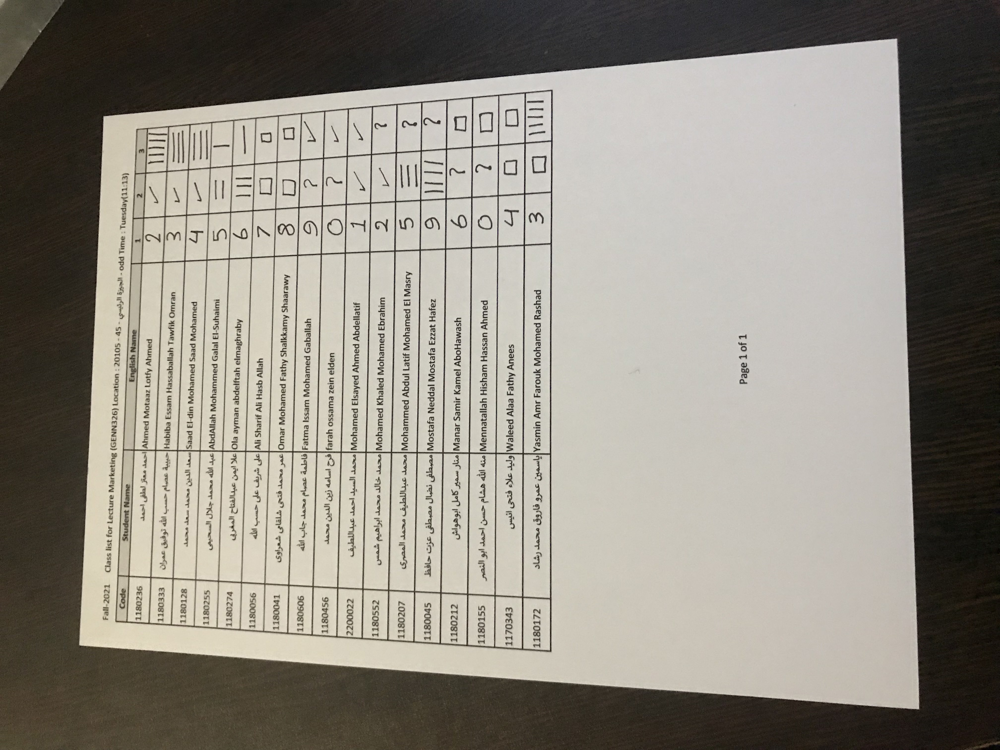
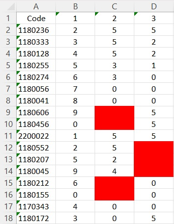

# Grades Auto Filler

## 📝 Table of Contents

- [About](#about)
- [Technology](#technolgies)
- [Getting Started](#started)
- [Grade Auto Filler Model](#grade_filler)
  - [Overview](graded_sheet_overview)
  - [Results](graded_sheet_results)


## 📙 About <a name = "about"></a>
- The main idea of (Grade Auto Filler) is to give an image of a table with some data to the program and get an output of excel sheet containing the data that was in that image after mapping the symbols to the wanted grades.

- The main idea of (Bubble sheet correction) islocalize the filled circles referenced to the number of columns and number of rowsand compare them to a given model answer and provide sheet of students’ grades.

## 💻 Technology <a name = "technolgies"></a>

- Python 
- Jupyter Notebook
- OpenCV

## 🏁 Getting Started <a name = "started"></a>

<ul>
<li>Clone the repository

<br>

```
git clone https://github.com/Waer1/Grades-Auto-Filler
```

</li>

<li>Install Packages

<br>

```
pip install -r requirements.txt
```

</li>

<li>To run the Grade Auto Filler

<br>

```
Set the path of the table image in the config file [configGrade.conf]
Set any other needed features in the config file [get names, wanted method to detect symbols and numbers, etc..]
Use the command "python gradesSheet.py"
```

</li>

<li>To run the Bubble Sheet Correction

<br>

```
Set the path of the directory of the samples in the config file [configBubble.conf]
If there is no id in the image, set the ids in the id list file
Set all the other important parameters in the config file [number of students, number of questions, number of choices, id length if exist, number of coulmns and rows, etc...]
Use the command "python bubbleSheet.py"
```

</li>
</ul>

<br>

***

<br>

<h2 align=center > Grade Auto Filler Model <a name = "grade_filler"></a></h2>

### 📷 OverView<a name = "graded_sheet_overview"></a>

- It allows you to turn an image into a digital form (excel sheet)
- It handles Skewing and orientation
- Printed Student ID is detected using OCR or Feature and execration
- Written Symbols like ✓ & ? are detect using HOG feature extractor and predicted using SVM or with normal image processing techniques
- Handwritten numeric values are detected using OCR and Feature and execration


### 📚 Results <a name = "graded_sheet_results"></a>

<h4 align=center>(1)</a></h4>

<table>
  <tr>
    <td width=40% valign="center"></td>
    <td width=40% valign="center"></td>
  </tr>
</table>


<h4 align=center>(2)</a></h4>

<table>
  <tr>
    <td width=40% valign="center"></td>
    <td width=40% valign="center"></td>
  </tr>
</table>
